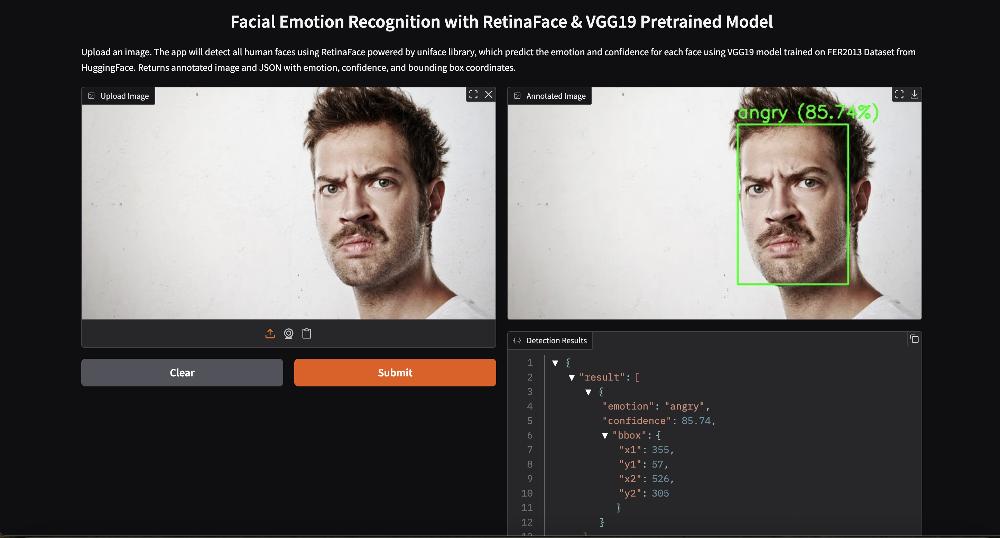

# Facial Expression Recognition

Detect facial expressions via image upload. Final Project for SkillAcademy AI
Application Batch 1.

## Setup

1. **Clone the repository**

   ```bash
   git clone https://github.com/hanseltertius/facial_expression_recognition.git
   cd facial_expression_recognition
   ```

2. **Create and activate a Python virtual environment**

   ```bash
   python3 -m venv venv
   source venv/bin/activate
   ```

3. **Install dependencies**
   ```bash
   pip install -r requirements.txt
   ```

## Running the Project

1. **Jupyter Notebook**

   - Launch Jupyter Notebook:
     ```bash
     jupyter notebook project.ipynb
     ```
   - Follow the notebook instructions to run the facial expression recognition
     workflow.

2. **Image Upload**
   - Upload your image as instructed in the notebook and view the results.

## Project Structure

- `project.ipynb`: Main notebook for facial expression recognition.
- `requirements.txt`: Python dependencies.
- `README.md`: Project documentation.

## Screenshots

Below are examples of how to use the image upload feature:

### 1. Upload an Image with a Single Face

- Select an image containing one face.
- The system will detect and display the facial expression for the detected
  face.



### 2. Upload an Image with Multiple Faces

- Select an image containing multiple faces.
- The system will detect all faces and display the facial expressions for each
  detected face.


## Notes

- Ensure you have Python 3.7+ installed.
